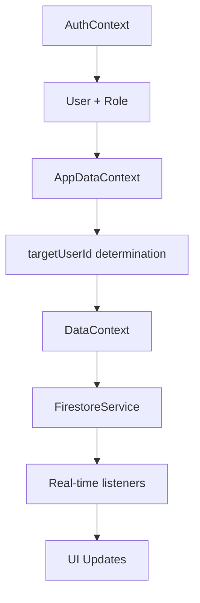
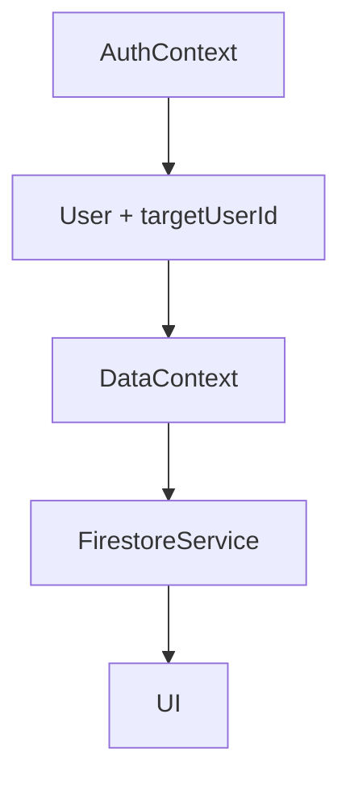

# 🔐 ANÁLISE DETALHADA - SISTEMA DE AUTENTICAÇÃO

## 📋 RESUMO EXECUTIVO

O sistema atual implementa autenticação Firebase com dois tipos de usuário (admin/child), mas possui **redundâncias significativas** e **lógica complexa desnecessária** que pode ser simplificada.

---

## 🏗️ ARQUITETURA ATUAL

### **Arquivos Principais:**
- `src/contexts/AuthContext.tsx` - Autenticação Firebase
- `src/contexts/AppDataContext.tsx` - Gerenciamento de dados do usuário
- `src/contexts/DataContext.tsx` - Dados de tarefas/recompensas
- `src/components/auth/LoginScreen.tsx` - Interface de login
- `src/components/auth/ProtectedRoute.tsx` - Proteção de rotas
- `src/App.tsx` - Roteamento principal

---

## 🔄 FLUXO DE AUTENTICAÇÃO ATUAL

### **1. PROCESSO DE LOGIN**

```mermaid
graph TD
    A[LoginScreen] --> B{Tipo de Login}
    B -->|Heitor| C[login('heitor@flash.com', '123456')]
    B -->|Admin| D[Formulário Email/Senha]
    C --> E[Firebase Auth]
    D --> E[Firebase Auth]
    E --> F[AuthContext.onAuthStateChanged]
    F --> G[ensureUserDocument]
    G --> H{Usuário existe no Firestore?}
    H -->|Não| I[Criar documento users/]
    H -->|Sim| J[Carregar dados existentes]
    I --> K[Determinar role baseado no email]
    J --> K
    K --> L[AppDataContext.setupUser]
    L --> M[Redirecionamento baseado no role]
```

### **2. DETERMINAÇÃO DE ROLES**

**Lógica Atual (AuthContext.tsx:75-80):**
```typescript
const isAdmin = firebaseUser.email === 'admin@flash.com';
const role = isAdmin ? 'admin' : 'child';
```

**Problema:** Hardcoded para email específico, não flexível.

### **3. CRIAÇÃO DE USUÁRIOS**

**Para Admin:**
```typescript
// AuthContext.tsx:85-95
const newUserData = {
  displayName: 'Pai',
  email: firebaseUser.email,
  role: 'admin',
  createdAt: serverTimestamp(),
  lastLoginTimestamp: serverTimestamp()
};

// Busca usuário child existente para linkar
if (isAdmin) {
  const usersSnapshot = await getDocs(collection(db, 'users'));
  const childUser = usersSnapshot.docs.find(doc => {
    const userData = doc.data();
    return userData.email === 'heitor@flash.com';
  });
  if (childUser) {
    newUserData.childId = childUser.id;
  }
}
```

**Para Child:**
```typescript
// Mesmo processo, mas role = 'child'
```

---

## 🛡️ PROTEÇÃO DE ROTAS

### **ProtectedRoute.tsx:**
```typescript
// Verifica se usuário está autenticado
if (!user) {
  return <Navigate to="/login" replace />;
}

// Verifica role
if (user.role !== requiredRole) {
  const redirectTo = user.role === 'admin' ? '/admin' : '/flash';
  return <Navigate to={redirectTo} replace />;
}
```

### **Rotas Definidas (App.tsx):**
```
/login - LoginScreen
/flash - HeroPanel (child only)
/admin - ParentPanel (admin only)
/ - RoleBasedRedirect (redireciona baseado no role)
```

---

## 📊 SINCRONIZAÇÃO DE DADOS

### **Fluxo de Dados:**



### **Lógica de targetUserId (AppDataContext.tsx:67-70):**
```typescript
// Admin: usa childId para gerenciar dados do filho
// Child: usa próprio ID
const target = user.role === 'admin' ? user.childId || null : user.id;
setTargetUserId(target);
```

### **Problema Identificado:**
- Admin pode ter `childId` como "heitor-placeholder" se child não existir ainda
- Causa erros ao tentar acessar dados inexistentes

---

## 🚨 PROBLEMAS IDENTIFICADOS

### **1. REDUNDÂNCIA DE CONTEXTOS**
- **AuthContext**: Autenticação Firebase
- **AppDataContext**: Gerenciamento de usuário atual
- **DataContext**: Dados de aplicação

**Problema:** Muita sobreposição de responsabilidades.

### **2. LÓGICA COMPLEXA DE LINKING**
```typescript
// AppDataContext.tsx:45-65 - Muito complexo
if (user.role === 'admin' && (!user.childId || user.childId === 'heitor-placeholder')) {
  const usersSnapshot = await getDocs(collection(db, 'users'));
  const childUser = usersSnapshot.docs.find(doc => {
    const data = doc.data();
    return data.email === 'heitor@flash.com';
  });
  // ... mais lógica complexa
}
```

### **3. HARDCODED EMAILS**
- `heitor@flash.com` hardcoded em múltiplos lugares
- `admin@flash.com` hardcoded para admin
- Não é escalável

### **4. MÚLTIPLAS VERIFICAÇÕES**
- Verificação de role em AuthContext
- Re-verificação em AppDataContext  
- Re-verificação em ProtectedRoute
- Re-verificação em DataContext

### **5. LOGS EXCESSIVOS**
- Console poluído com logs de debug
- Impacta performance

---

## 💡 RECOMENDAÇÕES DE OTIMIZAÇÃO

### **1. SIMPLIFICAR ARQUITETURA**
```typescript
// Proposta: Unificar AuthContext + AppDataContext
interface User {
  id: string;
  email: string;
  role: 'admin' | 'child';
  childId?: string; // apenas para admin
  // ... outros campos
}
```

### **2. CONFIGURAÇÃO FLEXÍVEL**
```typescript
// Substituir hardcoded emails por configuração
const USER_CONFIG = {
  CHILD_EMAIL: 'heitor@flash.com',
  ADMIN_EMAIL: 'admin@flash.com'
};
```

### **3. SIMPLIFICAR FLUXO DE DADOS**


### **4. REMOVER VERIFICAÇÕES REDUNDANTES**
- Uma única verificação de role no AuthContext
- ProtectedRoute apenas verifica autenticação
- Remover re-verificações desnecessárias

---

## 🎯 FLUXO SIMPLIFICADO PROPOSTO

### **Login:**
1. Usuário faz login (Firebase Auth)
2. AuthContext determina role baseado no email
3. AuthContext define targetUserId (próprio ID ou childId)
4. DataContext carrega dados do targetUserId
5. Redirecionamento automático

### **Navegação:**
1. ProtectedRoute verifica apenas se está autenticado
2. Redirecionamento baseado no role do usuário
3. Sem re-verificações

### **Dados:**
1. DataContext recebe targetUserId do AuthContext
2. Carrega dados em tempo real
3. UI atualiza automaticamente

---

## 📈 BENEFÍCIOS DA OTIMIZAÇÃO

1. **Performance:** Menos contextos, menos re-renders
2. **Manutenibilidade:** Código mais simples e direto
3. **Escalabilidade:** Fácil adicionar novos tipos de usuário
4. **Debug:** Menos logs, mais clareza
5. **UX:** Fluxo mais fluido e rápido

---

## 🔧 AÇÕES IMEDIATAS SUGERIDAS

1. **Unificar AuthContext + AppDataContext**
2. **Remover logs excessivos**
3. **Simplificar lógica de linking admin-child**
4. **Configurar emails em constantes**
5. **Otimizar ProtectedRoute**
6. **Testar fluxo completo**

---

**Status:** ⚠️ Sistema funcional mas com alta complexidade desnecessária
**Prioridade:** 🔥 Alta - Impacta performance e manutenibilidade